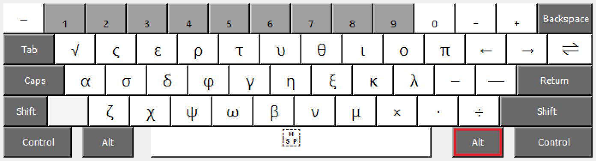
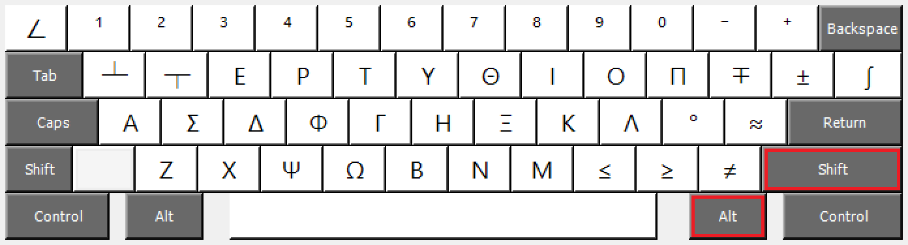

# ttd Keyboard
A keyboard layout for math and science.

## Introduction

This keyboard layout is non-intrusive, so you can install it and keep it on.
After installing the keyboard layout, enabling it in your system settings, and
switching to it, you’ll be able to access the primary layout (see below) by
holding down **Right-Alt** on Windows, or **Control ⌃ + Option ⌥** on Mac.
You’ll be able to access the secondary layout by holding down **Shift +
Right-Alt** on Windows, or **Shift ⇧ + Control ⌃ + Option ⌥** on Mac.

## Primary layout

**Windows:** Right-Alt + …  
**Mac:** Control ⌃ + Option ⌥ + …  

- ` → minus sign (−)
- numbers → subscript numbers (₁, ₂, ₃, etc.)
- – → subscript minus (₋)
- = → subscript plus (₊)
- q → square root (√)
- other letters → lowercase Greek letters (α, β, γ, etc.)
- [ → left arrow (←)
- ] → right arrow (→)
- \ → two-way arrow (⇌)
- ; → en dash (–)
- ' → em dash (—)
- , → multiplication sign (×)
- . → middle dot (∙)
- / → division sign (÷)
- space → hair space ( )

## Secondary layout

**Windows:** Shift + Right-Alt + …  
**Mac:** Shift ⇧ + Control ⌃ + Option ⌥ + …  

- ` → angle (∠)
- numbers → superscript numbers (¹, ², ³, etc.)
- – → superscript minus (⁻)
- = → superscript plus (⁺)
- q → equation modifier (┴)
- w → equation modifier (┬)
- other letters → uppercase Greek letters (Α, Β, Γ, etc.)
- [ → minus-plus (∓)
- ] → plus-minus (±)
- \ → integral (∫)
- ; → degrees (°)
- ' → approximately (≈)
- , → less than or equal to (≤)
- . → greater than or equal to (≥)
- / → not equal to (≠)
- space → full-width space (　)

## Dead keys

Subscript numbers 1–9 (Windows: Right-Alt + number, Mac: Control ⌃ + Option ⌥ +
number) double as dead keys. When typed before {A, E, I, O, U, V, N, M, a, e, i,
o, u, v, n, m} (where V and v represent Ü and ü, respectively) the letter will
be produced with the corresponding diacritic:

1.  Macron (ā)
2.  Acute accent (á)
3.  Caron (ǎ)
4.  Grave accent (à)
5.  Dot above (ȧ)
6.  Circumflex (â)
7.  Vertical line above (a̍)
8.  Tilde (ã)
9.  Special
    - Vv → Üü (Uu with umlaut)
    - Nn → ᴺⁿ (superscript Nn)
    - o → ◌͘  (combining dot above right)

A dead key can also be followed by a hyphen (-) to produce a combining
diacritic or an equals sign (=) to produce a non-combining diacritic. The
original subscript number is produced by following the key with a space.

## Platform-specific notes

**Windows:** Due to technical limitations, the following characters cannot be
produced directly using dead keys. Instead, it is necessary to type the
character and follow it with the appropriate combining diacritic.

1.  Macron (ā): N̄, M̄, n̄, m̄
2.  Acute accent (á): none
3.  Caron (ǎ): M̌, m̌
4.  Grave accent (à): M̀, m̀
5.  Dot above (ȧ): U̇, Ü̇, u̇, ü̇
6.  Circumflex (â): Ü̂, N̂, M̂, ü̂, n̂, m̂
7.  Vertical line above (a̍): A̍, E̍, I̍, O̍, U̍, Ü̍, N̍, M̍, a̍, e̍, i̍, o̍, u̍, ü̍, n̍, m̍
8.  Tilde ã: Ü̃, M̃, ü̃, m̃
9.  Special: none

**Mac:** To install for the current user only, copy the `.bundle` to
`~/Library/Keyboard Layouts`.

Copyright © 2013–2017 Kevin Hsieh. All Rights Reserved.
